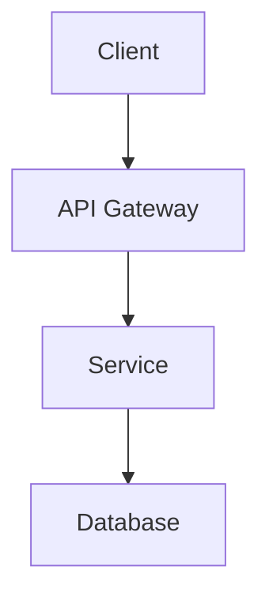

# MkDocs Documentation Template

This is a comprehensive MkDocs documentation template designed for technical projects. It provides a professional, feature-rich documentation site with modern styling and best practices.

## Features

### 🎨 Modern Design
- **Material Design** theme with dark/light mode support
- **Custom CSS** with project-specific styling
- **Responsive design** for all devices
- **Professional typography** and spacing

### 📖 Comprehensive Structure
- **Getting Started** guides (overview, quick start, installation)
- **Architecture** documentation (system design, security)
- **User Guide** with detailed instructions
- **Use Cases** and practical examples
- **Development** guides and best practices
- **Configuration** references
- **API documentation** templates
- **Troubleshooting** guides

### 🚀 Advanced Features
- **Search functionality** with highlighting
- **Git integration** for revision tracking and contributors
- **Mermaid diagrams** support
- **Code highlighting** with copy buttons
- **Tabbed content** for multiple approaches
- **Admonitions** for important information
- **Custom CSS classes** for enhanced styling

### 🔧 Technical Components
- **Component badges** and status indicators
- **HTTP method badges** for API documentation
- **Environment badges** (dev/staging/prod)
- **Command line styling** for terminal examples
- **Configuration blocks** with syntax highlighting
- **Table enhancements** with hover effects

## Quick Start

### 1. Copy the Template

```bash
# Copy the entire _template_docs folder to your project
cp -r _template_docs/ /path/to/your/project/docs/
cd /path/to/your/project/docs/
```

### 2. Customize Configuration

Edit `mkdocs.yml` and update:

```yaml
# Basic information
site_name: Your Project Name
site_description: Your project description
site_author: Your Team Name
site_url: https://your-org.github.io/your-project

# Repository information
repo_name: your-project
repo_url: https://github.com/your-org/your-project

# Git committers plugin
plugins:
  - git-committers:
      repository: your-org/your-project
```

### 3. Install Dependencies

```bash
pip install mkdocs-material
pip install mkdocs-git-revision-date-localized-plugin
pip install mkdocs-git-committers-plugin-2
```

### 4. Customize Content

Update the template content:

1. **Homepage** (`docs/index.md`) - Update with your project information
2. **Requirements** (`docs/requirements.md`) - Specify your project requirements
3. **Components** (`docs/components.md`) - Document your system architecture
4. **Getting Started** - Update installation and setup instructions
5. **Navigation** - Modify the `nav` section in `mkdocs.yml`

### 5. Customize Styling

Edit `docs/assets/stylesheets/extra.css`:

```css
/* Update color scheme */
:root {
    --project-primary: #your-primary-color;
    --project-secondary: #your-secondary-color;
    --project-accent: #your-accent-color;
}
```

### 6. Build and Serve

```bash
# Serve locally for development
mkdocs serve

# Build for production
mkdocs build
```

## Directory Structure

```
_template_docs/
├── mkdocs.yml                 # Main configuration
├── docs/
│   ├── index.md              # Homepage
│   ├── requirements.md       # System requirements
│   ├── components.md         # Architecture overview
│   ├── getting-started/
│   │   ├── overview.md       # Getting started overview
│   │   ├── quick-start.md    # Quick setup guide
│   │   └── installation.md   # Detailed installation
│   ├── architecture/
│   │   ├── system-design.md  # System architecture
│   │   └── security-model.md # Security documentation
│   ├── user-guide/
│   │   ├── basic-operations.md
│   │   └── advanced-configuration.md
│   ├── use-cases/
│   │   ├── overview.md
│   │   └── use-case-*.md
│   ├── development/
│   │   ├── development-setup.md
│   │   ├── testing-guide.md
│   │   ├── quality-assurance.md
│   │   └── release-management.md
│   ├── configuration/
│   │   ├── basic-config.md
│   │   ├── advanced-settings.md
│   │   └── security.md
│   ├── api/
│   │   ├── overview.md
│   │   ├── endpoints.md
│   │   └── authentication.md
│   ├── troubleshooting/
│   │   ├── common-issues.md
│   │   └── debugging.md
│   └── assets/
│       ├── stylesheets/
│       │   └── extra.css     # Custom styling
│       ├── javascripts/
│       └── images/
└── README.md                 # This file
```

## Customization Guide

### Adding New Sections

1. Create new directory in `docs/`
2. Add markdown files
3. Update navigation in `mkdocs.yml`:

```yaml
nav:
  - Your New Section:
    - Overview: your-section/overview.md
    - Details: your-section/details.md
```

### Custom CSS Classes

The template includes several custom CSS classes:

```markdown
<!-- Component badges -->
<span class="component-type service">Service</span>
<span class="component-type database">Database</span>

<!-- Status indicators -->
<span class="status-indicator running">Running</span>
<span class="status-indicator stopped">Stopped</span>

<!-- HTTP method badges -->
<span class="http-method get">GET</span>
<span class="http-method post">POST</span>

<!-- Environment badges -->
<span class="env-badge dev">DEV</span>
<span class="env-badge staging">STAGING</span>
<span class="env-badge prod">PROD</span>

<!-- API keys/tokens -->
<span class="api-key">your-api-key-here</span>
```

### Mermaid Diagrams

The template supports Mermaid diagrams:

```markdown

```

### Code Blocks with Tabs

Use tabbed content for multiple examples:

```markdown
=== "Python"
    ```python
    def hello():
        print("Hello World")
    ```

=== "JavaScript"
    ```javascript
    function hello() {
        console.log("Hello World");
    }
    ```
```

## GitHub Pages Deployment

### 1. Enable GitHub Pages

In your repository settings:
1. Go to **Settings** → **Pages**
2. Select **Source**: GitHub Actions
3. Create `.github/workflows/docs.yml`:

```yaml
name: Build and Deploy Documentation

on:
  push:
    branches: [ main ]
  pull_request:
    branches: [ main ]

permissions:
  contents: read
  pages: write
  id-token: write

jobs:
  build:
    runs-on: ubuntu-latest
    steps:
    - uses: actions/checkout@v4
      with:
        fetch-depth: 0
    
    - name: Setup Python
      uses: actions/setup-python@v4
      with:
        python-version: '3.x'
    
    - name: Install dependencies
      run: |
        pip install mkdocs-material
        pip install mkdocs-git-revision-date-localized-plugin
        pip install mkdocs-git-committers-plugin-2
    
    - name: Build documentation
      env:
        MKDOCS_GIT_COMMITTERS_APIKEY: ${{ secrets.GITHUB_TOKEN }}
      run: mkdocs build
    
    - name: Upload artifact
      uses: actions/upload-pages-artifact@v2
      with:
        path: site
  
  deploy:
    environment:
      name: github-pages
      url: ${{ steps.deployment.outputs.page_url }}
    runs-on: ubuntu-latest
    needs: build
    steps:
      - name: Deploy to GitHub Pages
        id: deployment
        uses: actions/deploy-pages@v2
```

### 2. Update Configuration

Make sure your `mkdocs.yml` has the correct `site_url`:

```yaml
site_url: https://your-username.github.io/your-repository/
```

## Tips and Best Practices

### Content Organization
- Use clear, descriptive headings
- Keep pages focused on single topics
- Cross-reference related content
- Include practical examples

### Writing Style
- Use active voice
- Write concise, scannable content
- Include code examples
- Add screenshots for UI elements

### Maintenance
- Review and update content regularly
- Check for broken links
- Update dependencies
- Monitor site performance

## Support

For questions about this template:

1. Check the [MkDocs documentation](https://www.mkdocs.org/)
2. Review [Material theme docs](https://squidfunk.github.io/mkdocs-material/)
3. Look at the example implementations
4. Create an issue in the template repository

## License

This template is provided as-is for use in your projects. Customize and adapt as needed for your specific requirements.
