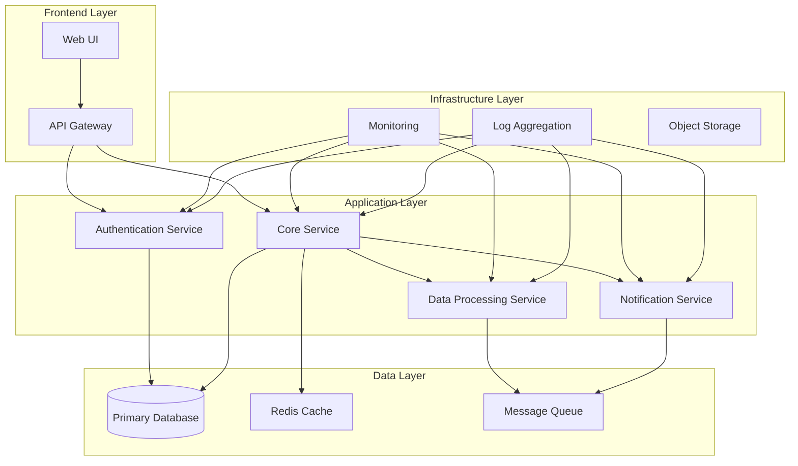
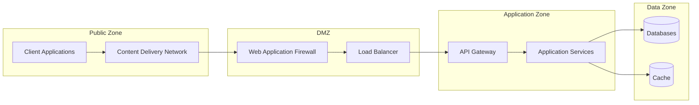

# System Components

This document provides a comprehensive overview of all system components, their relationships, and key functionalities.

## Architecture Overview

The system is built using a microservices architecture with the following main components:

## Core Components

### 1. API Gateway

The API Gateway serves as the single entry point for all client requests.

| Attribute | Details |
|-----------|---------|
| **Technology** | Kong / Nginx / Traefik |
| **Port** | 80/443 |
| **Responsibilities** | Request routing, Rate limiting, Authentication, SSL termination |
| **Dependencies** | Authentication Service |

**Key Features:**
- Request/response transformation
- Load balancing
- API versioning
- Request/response caching
- Security policies enforcement

### 2. Core Service

The main business logic component that handles primary application functionality.

| Attribute | Details |
|-----------|---------|
| **Technology** | Node.js / Python / Java |
| **Port** | 8080 |
| **Responsibilities** | Business logic, Data validation, Workflow orchestration |
| **Dependencies** | Database, Cache, Message Queue |

**Key Features:**
- RESTful API endpoints
- Business rule processing
- Data transformation
- Integration with external services
- Event publishing

### 3. Authentication Service

Handles user authentication, authorization, and session management.

| Attribute | Details |
|-----------|---------|
| **Technology** | OAuth 2.0 / OpenID Connect |
| **Port** | 8081 |
| **Responsibilities** | User authentication, Token management, Access control |
| **Dependencies** | Database, External identity providers |

**Key Features:**
- Multi-factor authentication
- Single sign-on (SSO)
- Role-based access control (RBAC)
- Token validation
- User session management

### 4. Data Processing Service

Handles data processing, transformation, and analytics tasks.

| Attribute | Details |
|-----------|---------|
| **Technology** | Python / Scala / Go |
| **Port** | 8082 |
| **Responsibilities** | Data processing, ETL operations, Analytics |
| **Dependencies** | Message Queue, Database, Object Storage |

**Key Features:**
- Real-time data processing
- Batch processing capabilities
- Data validation and cleansing
- Analytics and reporting
- Data pipeline orchestration

### 5. Notification Service

Manages all system notifications and communication.

| Attribute | Details |
|-----------|---------|
| **Technology** | Node.js / Python |
| **Port** | 8083 |
| **Responsibilities** | Email notifications, Push notifications, SMS alerts |
| **Dependencies** | Message Queue, External notification providers |

**Key Features:**
- Multi-channel notifications
- Template management
- Delivery tracking
- Retry mechanisms
- Notification preferences

## Data Components

### Primary Database

The main data store for application data.

| Attribute | Details |
|-----------|---------|
| **Technology** | PostgreSQL |
| **Port** | 5432 |
| **Storage** | 100GB+ |
| **Backup** | Daily automated backups |

**Schema Overview:**
- User management tables
- Application data tables
- Configuration tables
- Audit logging tables

### Redis Cache

High-performance caching layer for frequently accessed data.

| Attribute | Details |
|-----------|---------|
| **Technology** | Redis |
| **Port** | 6379 |
| **Memory** | 8GB |
| **Persistence** | RDB snapshots |

**Cache Strategies:**
- Session storage
- API response caching
- Database query caching
- Rate limiting data

### Message Queue

Asynchronous message processing for decoupled services.

| Attribute | Details |
|-----------|---------|
| **Technology** | RabbitMQ / Apache Kafka |
| **Port** | 5672 / 9092 |
| **Persistence** | Durable queues |
| **High Availability** | Clustered setup |

**Queue Types:**
- Event publishing
- Background job processing
- Inter-service communication
- Dead letter queues

## Infrastructure Components

### Monitoring Stack

Comprehensive monitoring and observability solution.

=== "Metrics Collection"
    **Prometheus**
    - Service metrics collection
    - Custom metric definitions
    - Alert rule configuration
    - Data retention: 30 days

=== "Visualization"
    **Grafana**
    - Custom dashboards
    - Alert visualization
    - Multi-datasource support
    - User access controls

=== "Alerting"
    **AlertManager**
    - Alert routing
    - Notification channels
    - Alert grouping
    - Silence management

### Logging Infrastructure

Centralized logging for all system components.

| Component | Technology | Purpose |
|-----------|------------|---------|
| **Log Shipper** | Filebeat / Fluentd | Log collection from services |
| **Log Processing** | Logstash / Fluentd | Log parsing and enrichment |
| **Log Storage** | Elasticsearch | Searchable log storage |
| **Log Visualization** | Kibana | Log analysis and dashboards |

### Object Storage

Scalable storage for files and large objects.

| Attribute | Details |
|-----------|---------|
| **Technology** | MinIO / AWS S3 |
| **Capacity** | Unlimited |
| **Accessibility** | REST API |
| **Backup** | Cross-region replication |

## Component Interactions

### Service Communication Patterns

1. **Synchronous Communication**
   - HTTP/REST API calls
   - Direct service-to-service calls
   - Real-time data exchange

2. **Asynchronous Communication**
   - Message queue-based
   - Event-driven architecture
   - Eventual consistency

3. **Data Access Patterns**
   - Database connection pooling
   - Cache-aside pattern
   - Read replicas for scaling

### Security Boundaries

## Deployment Architecture

### Container Orchestration

| Component | Container Image | Resource Requirements |
|-----------|-----------------|----------------------|
| API Gateway | nginx:alpine | 0.5 CPU, 512MB RAM |
| Core Service | app:latest | 1 CPU, 1GB RAM |
| Auth Service | auth:latest | 0.5 CPU, 512MB RAM |
| Data Service | data-processor:latest | 2 CPU, 2GB RAM |
| Notification Service | notifications:latest | 0.5 CPU, 512MB RAM |

### High Availability Setup

- **Load Balancing**: Multiple instances behind load balancer
- **Database**: Master-slave replication
- **Cache**: Redis cluster with sentinel
- **Message Queue**: Clustered setup with failover
- **Storage**: Distributed storage with replication

## Maintenance and Operations

### Health Checks

Each component implements health check endpoints:

- `/health` - Basic health status
- `/ready` - Readiness for traffic
- `/metrics` - Prometheus metrics

### Backup Strategy

| Component | Backup Frequency | Retention |
|-----------|------------------|-----------|
| Database | Daily | 30 days |
| Configuration | Weekly | 90 days |
| Logs | Real-time | 30 days |
| Object Storage | Continuous | 1 year |

### Update Strategy

- **Rolling Updates**: Zero-downtime deployments
- **Blue-Green**: For critical components
- **Database Migrations**: Automated with rollback capability
- **Configuration Changes**: Version controlled and tested

!!! info "Component Status"
    All components are actively maintained and regularly updated. Check the [Release Management](development/release-management.md) guide for update procedures.
