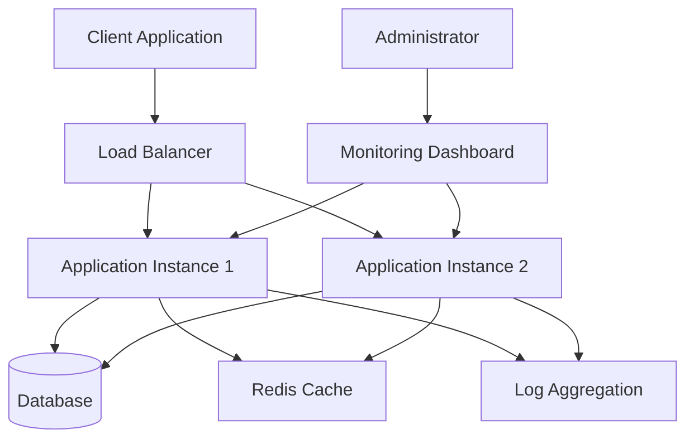

# Project Documentation Template

Welcome to the comprehensive documentation for your technical project. This documentation provides everything you need to deploy, configure, and manage your solution.

## 🚀 Quick Overview

This project provides a complete solution for your technical needs:

!!! success "Key Features"
    - **Feature 1** - Brief description of key feature
    - **Feature 2** - Brief description of key feature
    - **Feature 3** - Brief description of key feature
    - **Feature 4** - Brief description of key feature
    - **Feature 5** - Brief description of key feature
    - **Feature 6** - Brief description of key feature

## 📚 Documentation Structure

### Getting Started
Perfect for new users who want to quickly deploy and test the solution.

[Get Started :material-rocket:](getting-started/overview.md){ .md-button .md-button--primary }

### Architecture Documentation
Deep dive into the system architecture, design decisions, and security model.

[View Architecture :material-sitemap:](architecture/system-design.md){ .md-button }

### User Guide
Step-by-step instructions for common operations and advanced configurations.

[User Guide :material-book-open-page-variant:](user-guide/basic-operations.md){ .md-button }

## 🎯 Use Cases

This solution is ideal for:

=== "Development"
    - Local development environments
    - Testing configurations
    - Development workflows
    - Container orchestration

=== "Production"
    - Production deployments
    - Enterprise solutions
    - Scalable infrastructure
    - Mission-critical systems

=== "Learning"
    - Understanding core concepts
    - Best practices
    - System configuration
    - Security implementation

## 🔧 Quick Start

1. **Clone the repository**
   ```bash
   git clone https://github.com/your-org/your-project.git
   cd your-project
   ```

2. **Start the application**
   ```bash
   docker-compose up -d
   ```

3. **Test the setup**
   ```bash
   curl http://localhost:8080/health
   ```

!!! tip "First Time?"
    Check out our [Quick Start Guide](getting-started/quick-start.md) for a complete walkthrough.

## 🛡️ Security Features

The solution includes enterprise-grade security features:

| Feature | Description | Status |
|---------|-------------|--------|
| Authentication | User authentication and authorization | ✅ Implemented |
| Encryption | Data encryption at rest and in transit | ✅ Implemented |
| Access Control | Role-based access control | ✅ Implemented |
| Audit Logging | Comprehensive security and operational logging | ✅ Implemented |
| Monitoring | Real-time security monitoring | ✅ Implemented |

## 📊 Architecture Overview



## 🤝 Contributing

We welcome contributions! Whether you're fixing bugs, improving documentation, or adding new features, your help is appreciated.

Check the project repository for contribution guidelines and open issues.

## 📞 Support

Need help? Here are your options:

- 📖 Check the [User Guide](user-guide/basic-operations.md)
- 🔍 Review the [Troubleshooting Guide](troubleshooting/common-issues.md)
- 🐛 Report issues on GitHub
- 💬 Join our community discussions

---

!!! info "Version Information"
    This documentation is for version 1.0.0 of the project.
